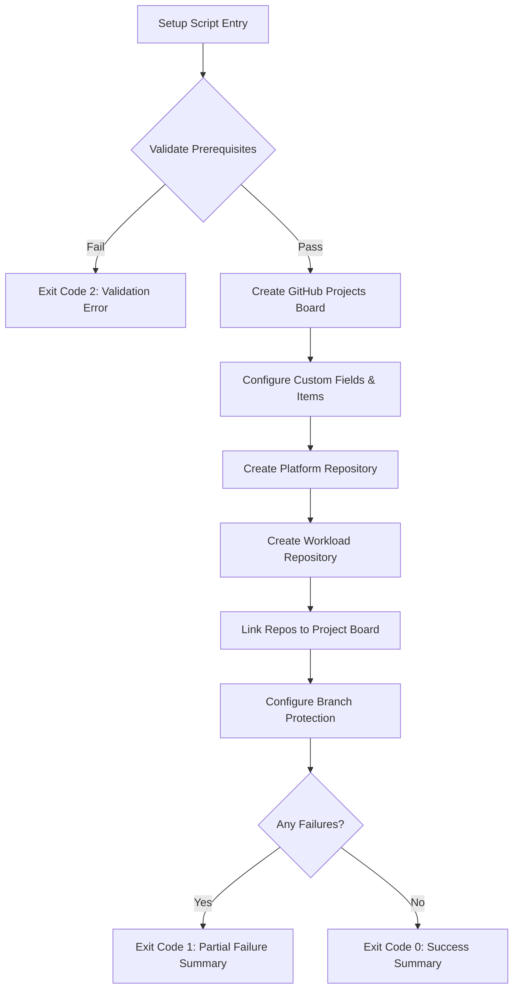

# Design Document: DevSecOps Phase 1 — Organization

## Overview

Phase 1 establishes the organizational foundation for the Azure DevSecOps Pipeline Architecture by automating the creation of GitHub resources via a single setup script. The script uses GitHub CLI (`gh`) to provision a GitHub Projects (v2) board, two repositories (Platform and Workload), branch protection rules, documentation, and repository-to-board linkages.

The design prioritizes:
- **Idempotency**: Safe to re-run without duplicating resources
- **Error resilience**: Continues provisioning independent resources when one fails
- **Portability**: Single script, no dependencies beyond `gh` CLI
- **Learning value**: Each generated artifact includes explanatory documentation

No cloud infrastructure is provisioned. All operations target the GitHub API through the `gh` CLI.

## Architecture

The system is a single PowerShell/Bash automation script that orchestrates GitHub CLI commands in a defined sequence with validation, error handling, and idempotency checks.



### Execution Flow

1. **Prerequisite Validation** — Verify `gh` CLI installed, version check, authentication status, required scopes (`repo`, `project`)
2. **Project Board Setup** — Create or update the GitHub Projects (v2) board with custom fields and task items
3. **Repository Creation** — Create Platform and Workload repositories with initial file structures
4. **Repository Linking** — Link both repositories to the project board
5. **Branch Protection** — Apply protection rules to `main` branch on both repositories
6. **Summary Output** — Report creation status of each resource

### Design Decisions

| Decision | Rationale |
|----------|-----------|
| Single script (not multiple) | Simpler execution model; one command to reproduce the entire foundation |
| PowerShell with Bash fallback | Windows-first development environment; cross-platform `gh` CLI abstracts OS differences |
| `gh` CLI over raw REST API | Higher-level commands, built-in auth management, simpler error handling |
| `gh api` for branch protection | No native `gh` subcommand for branch protection; REST API via `gh api` is the standard approach |
| `gh project` subcommands for board | Native v2 project support in `gh` CLI since v2.21+ |
| Idempotent by name-check | Each resource is checked by name before creation; existing resources are skipped |
| Continue-on-failure pattern | Independent resources (repos, board) don't block each other; failures are collected and reported at end |

## Components and Interfaces

### Component 1: Setup Script (`scripts/setup-phase1.ps1`)

The main orchestrator script. Accepts configuration parameters and coordinates all operations.

**Interface:**
```powershell
# Parameters
param(
    [Parameter(Mandatory=$true)]
    [string]$ProjectPrefix,          # e.g., "devsecops"
    
    [Parameter(Mandatory=$false)]
    [string]$GitHubOwner = "@me"     # GitHub user/org, defaults to authenticated user
)
```

**Exit Codes:**
- `0` — All resources created/verified successfully
- `1` — One or more operational failures (resource creation failed)
- `2` — Prerequisite validation failure (CLI missing, not authenticated, insufficient scopes)

### Component 2: Prerequisite Validator

Validates environment before any resource creation.

**Checks performed:**
1. `gh` CLI binary exists on PATH
2. `gh --version` meets minimum version (≥ 2.21.0 for project subcommands)
3. `gh auth status` confirms active authentication
4. Token scopes include `repo` and `project` (via `gh auth status`)

**Behavior:**
- On success: silent, proceeds to resource creation
- On failure: prints specific error + remediation steps, exits with code 2

### Component 3: Project Board Manager

Creates and configures the GitHub Projects (v2) board.

**Operations:**
```
gh project create --owner <owner> --title "Azure DevSecOps Pipeline Architecture"
gh project field-create <project-number> --owner <owner> --name "Phase" --data-type "SINGLE_SELECT" --single-select-options "Phase 1: Organization,Phase 2: Infrastructure,Phase 3: CI/CD,Phase 4: Delivery"
gh project item-add <project-number> --owner <owner> --url <draft-issue-url>
```

**Idempotency:** Lists existing projects via `gh project list --owner <owner>`, checks for title match before creating.

**Update logic:** If board exists, verifies custom fields match required configuration. Creates missing fields, reports status.

### Component 4: Repository Creator

Creates repositories with initial file structures using `gh repo create` and `git` operations.

**Platform Repository operations:**
```
gh repo create <owner>/<prefix>-platform-infrastructure --public --description "..." --clone
# Initialize directory structure via local git operations
# Commit and push initial structure
```

**Workload Repository operations:**
```
gh repo create <owner>/<prefix>-workload --public --description "..." --clone
# Initialize directory structure
# Commit and push
```

**Idempotency:** Checks `gh repo view <owner>/<name>` before creation. If exists, skips and reports "already existed."

**Error handling:** Name conflicts exit with error message. Other failures (network, permissions) are logged and collected.

### Component 5: Branch Protection Configurator

Applies branch protection rules via the GitHub REST API through `gh api`.

**API call:**
```
gh api repos/<owner>/<repo>/branches/main/protection \
  --method PUT \
  --field required_status_checks='{"strict":true,"contexts":["ci/pipeline-check"]}' \
  --field enforce_admins=true \
  --field required_pull_request_reviews='{"required_approving_review_count":1}' \
  --field restrictions=null
```

**Configuration applied:**
- Require 1 PR review approval
- Enforce for administrators (no direct pushes)
- Require status checks (placeholder context: `ci/pipeline-check`)

**Error handling:** Logs warning per-repository if protection fails; does not block other operations.

### Component 6: Repository Linker

Links repositories to the project board so issues/PRs appear on the board.

**Operations:**
```
gh project link <project-number> --owner <owner> --repo <owner>/<repo-name>
```

**Error handling:** Reports specific repository name and failure reason on error.

### Component 7: Summary Reporter

Collects results from all operations and outputs a formatted summary table.

**Output format:**
```
╔══════════════════════════════════════════════════════════════╗
║ Phase 1 Setup Summary                                       ║
╠══════════════════════════════════════════════════════════════╣
║ Resource Type      │ Name                        │ Status   ║
║ Project Board      │ Azure DevSecOps Pipeline... │ Created  ║
║ Platform Repo      │ devsecops-platform-infra... │ Created  ║
║ Workload Repo      │ devsecops-workload          │ Existed  ║
║ Branch Protection  │ platform/main               │ Applied  ║
║ Branch Protection  │ workload/main               │ Applied  ║
║ Board Link         │ platform → board            │ Linked   ║
║ Board Link         │ workload → board            │ Linked   ║
╚══════════════════════════════════════════════════════════════╝
```

## Data Models

### Script Configuration

```powershell
# Internal tracking object for operation results
class OperationResult {
    [string]$ResourceType    # "ProjectBoard", "Repository", "BranchProtection", "BoardLink"
    [string]$ResourceName    # Human-readable name
    [string]$Status          # "Created", "AlreadyExisted", "Updated", "Failed"
    [string]$ErrorMessage    # Empty on success, failure reason on error
}
```

### Platform Repository File Structure

```
<prefix>-platform-infrastructure/
├── main.tf                          # Configuration router — consumes child modules
├── variables.tf                     # Root-level variable declarations
├── outputs.tf                       # Root-level outputs
├── providers.tf                     # Provider + backend config (key omitted)
├── environments/
│   └── project-alpha-dev.tfvars     # Example environment variables
├── modules/
│   ├── network/
│   │   ├── main.tf
│   │   ├── variables.tf
│   │   └── outputs.tf
│   ├── aks/
│   │   ├── main.tf
│   │   ├── variables.tf
│   │   └── outputs.tf
│   └── security/
│       ├── main.tf
│       ├── variables.tf
│       └── outputs.tf
├── .github/
│   └── workflows/
│       └── terraform-deploy.yml     # Pipeline with dynamic state key + var-file
├── .gitignore
└── README.md
```

### Workload Repository File Structure

```
<prefix>-workload/
├── src/
│   └── .gitkeep
├── docker/
│   └── .gitkeep
├── .gitignore
└── README.md
```

### GitHub Projects Board Schema

| Field | Type | Values |
|-------|------|--------|
| Title | Text | "Azure DevSecOps Pipeline Architecture" |
| Description | Text | Contains "tracks security-integrated delivery across the DevSecOps pipeline lifecycle" |
| Status | Single Select | "Todo", "In Progress", "Done" |
| Phase | Single Select (custom) | "Phase 1: Organization", "Phase 2: Infrastructure", "Phase 3: CI/CD", "Phase 4: Delivery" |

### Branch Protection Configuration

```json
{
  "required_status_checks": {
    "strict": true,
    "contexts": ["ci/pipeline-check"]
  },
  "enforce_admins": true,
  "required_pull_request_reviews": {
    "required_approving_review_count": 1
  },
  "restrictions": null
}
```

## Error Handling

### Error Categories and Exit Codes

| Category | Exit Code | Behavior |
|----------|-----------|----------|
| CLI not installed | 2 | Print error + install instructions, exit immediately |
| CLI not authenticated | 2 | Print error + `gh auth login` instructions, exit immediately |
| Insufficient scopes | 2 | Print error + `gh auth refresh -s repo,project` instructions, exit immediately |
| Repository name conflict | 1 | Log error for that repo, continue with other resources |
| Network failure | 1 | Log error for affected operation, continue with independent operations |
| API permission error | 1 | Log warning (branch protection), continue |
| Unknown/unexpected error | 1 | Log error with full context, continue with remaining operations |

### Error Message Format

All error messages follow a consistent structure:
```
[ERROR] <Operation> failed for <ResourceName>: <Reason>
        Remediation: <Actionable step>
```

Warning messages (non-fatal):
```
[WARN] <Operation> for <ResourceName>: <Reason>
       The script will continue with remaining operations.
```

### Idempotency Strategy

| Resource | Detection Method | Existing Resource Behavior |
|----------|-----------------|---------------------------|
| Project Board | `gh project list` title match | Verify fields, update if needed |
| Platform Repo | `gh repo view` exit code | Skip creation, report "already existed" |
| Workload Repo | `gh repo view` exit code | Skip creation, report "already existed" |
| Branch Protection | Applied after repo exists | Re-apply (PUT is idempotent) |
| Board Links | `gh project link` is idempotent | Re-link silently |

### Failure Isolation

The script uses a continue-on-failure pattern for independent resources:

```powershell
$results = @()

# Each operation is wrapped in try/catch
try {
    $results += Create-ProjectBoard
} catch {
    $results += [OperationResult]@{ Status = "Failed"; ErrorMessage = $_.Exception.Message }
}

# Independent operations continue regardless of prior failures
try {
    $results += Create-PlatformRepo
} catch {
    $results += [OperationResult]@{ Status = "Failed"; ErrorMessage = $_.Exception.Message }
}

# Dependent operations check prerequisites
if ($platformRepoCreated -or $platformRepoExists) {
    try {
        $results += Set-BranchProtection -Repo $platformRepoName
    } catch {
        $results += [OperationResult]@{ Status = "Failed"; ErrorMessage = $_.Exception.Message }
    }
}
```

## Testing Strategy

### Why Property-Based Testing Does Not Apply

This feature consists entirely of:
- **Shell script automation** — orchestrating external CLI commands
- **External service interactions** — all operations target the GitHub API
- **Side-effect-only operations** — creating repos, boards, protection rules
- **Configuration/setup** — one-time provisioning of organizational resources

There are no pure functions with meaningful input variation, no data transformations, and no parsers or serializers. The behavior is deterministic given the same GitHub state. Property-based testing is not appropriate here.

### Testing Approach

#### 1. Manual Integration Testing (Primary)

Since all operations interact with the GitHub API, the primary testing method is executing the script against a real GitHub account:

**Test scenarios:**
- Fresh execution (no pre-existing resources)
- Idempotent re-execution (all resources already exist)
- Partial state (some resources exist, others don't)
- Failure recovery (simulate network issues, permission errors)

#### 2. Script Validation Tests (Automated)

Validate script structure and logic without executing GitHub operations:

| Test | Method | Validates |
|------|--------|-----------|
| Syntax check | `pwsh -c "Get-Command ./setup-phase1.ps1"` | Script parses without errors |
| Parameter validation | Invoke with missing `$ProjectPrefix` | Exits with code 2, shows usage |
| Help output | Invoke with `-Help` flag | Displays parameter documentation |
| Exit code contract | Mock `gh` commands, verify exit codes | Correct exit code per scenario |

#### 3. Dry-Run Mode

The script should support a `-WhatIf` or `-DryRun` flag that:
- Performs all validation checks
- Prints each command that *would* be executed
- Does not make any API calls
- Validates the execution plan without side effects

#### 4. Smoke Tests (Post-Execution Verification)

After script execution, verify resources exist:

```powershell
# Verify project board exists
gh project list --owner @me --format json | ConvertFrom-Json | Where-Object { $_.title -eq "Azure DevSecOps Pipeline Architecture" }

# Verify repositories exist
gh repo view <owner>/<prefix>-platform-infrastructure --json name
gh repo view <owner>/<prefix>-workload --json name

# Verify branch protection
gh api repos/<owner>/<prefix>-platform-infrastructure/branches/main/protection

# Verify board links
gh project view <number> --owner @me --format json
```

#### 5. Cleanup Script

A companion `teardown-phase1.ps1` script for test environments that removes all created resources, enabling repeatable testing cycles.
