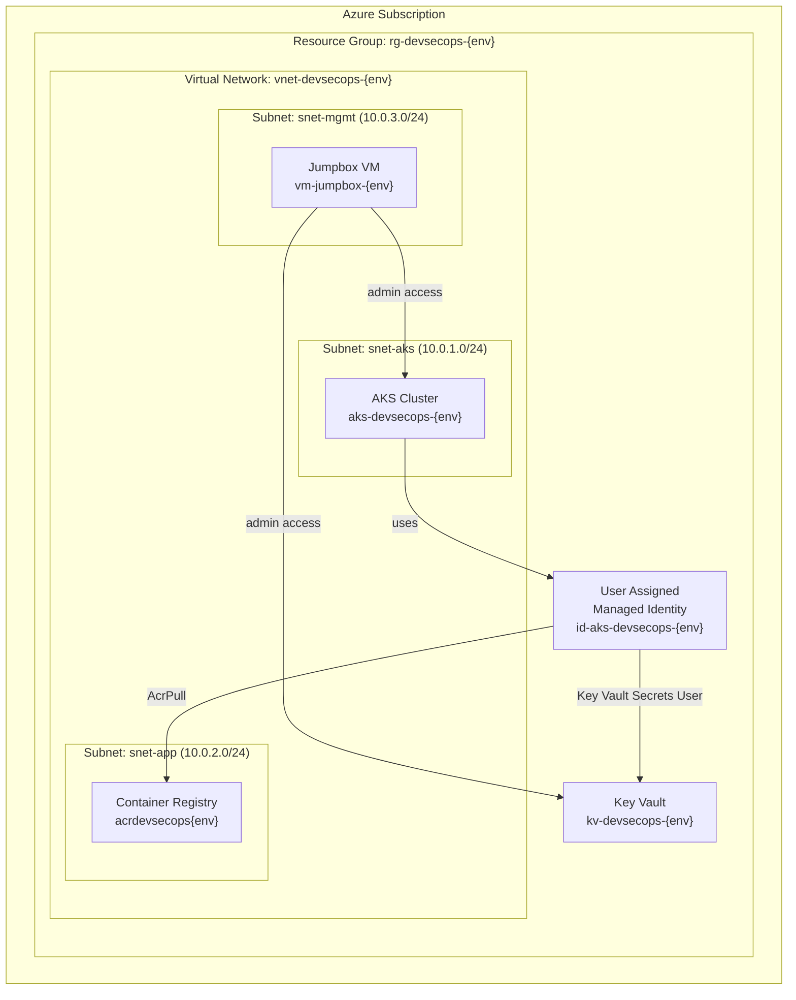
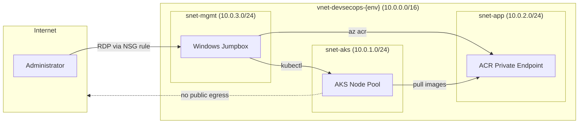
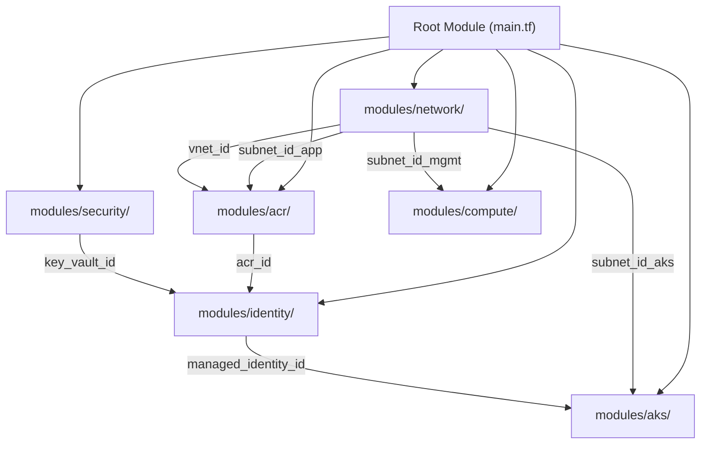
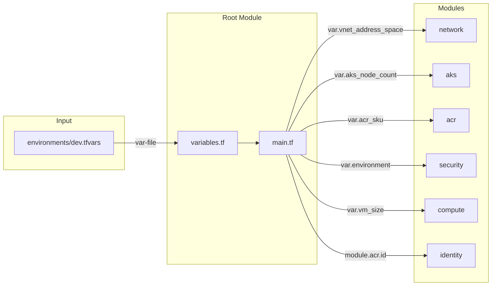
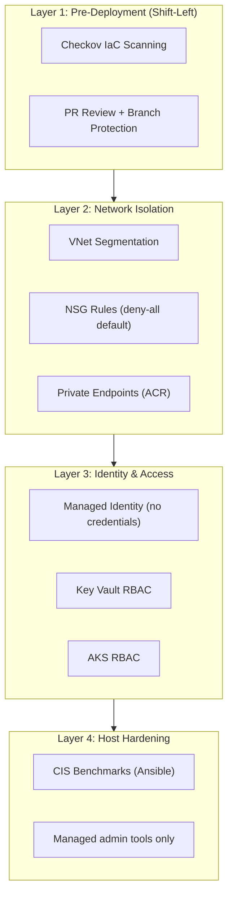
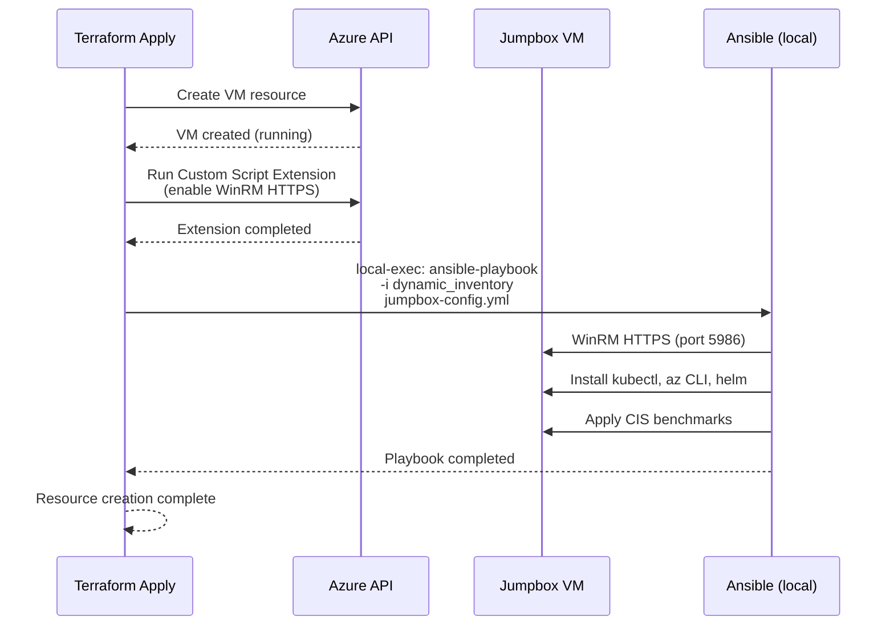

# Design Document: DevSecOps Phase 2 — Infrastructure and Security Baseline

## Overview

Phase 2 provisions the core Azure cloud infrastructure that all subsequent phases depend on. It transforms the Platform Repository's Terraform modules (created in Phase 1) into live, security-hardened Azure resources: an isolated virtual network with purpose-specific subnets, a private container registry, a secrets vault, a managed Kubernetes cluster, and an administrative jumpbox configured via Ansible.

This phase introduces three tools into the pipeline: **Terraform** (declarative infrastructure provisioning), **Checkov** (pre-deployment IaC security scanning), and **Ansible** (post-deployment configuration management). Together they implement the "shift-left" security principle — catching misconfigurations before deployment and enforcing CIS benchmarks on running systems.

The design follows the Platform Repository's modular architecture established in Phase 1: each Azure resource group is managed by a dedicated Terraform module under `modules/`, all configuration flows through `environments/*.tfvars` files, and state isolation is maintained via dynamic backend keys. The GitHub Actions workflow integrates Checkov as a mandatory gate before `terraform apply`, ensuring no misconfigured infrastructure reaches Azure.

## Architecture

### Resource Topology



### Network Security Architecture



### Why This Architecture

| Decision | Rationale |
|----------|-----------|
| Single VNet with 3 subnets | Simplest network isolation model that still demonstrates subnet-level security boundaries. Each subnet has a distinct purpose and NSG. |
| Private ACR (no public access) | Demonstrates zero-trust principle — container images are only accessible from within the VNet, preventing supply-chain attacks via public registry exposure. |
| User Assigned Managed Identity | Avoids storing credentials in code or Key Vault for Azure-to-Azure authentication. User Assigned (vs System Assigned) allows pre-creation and role assignment before the AKS cluster exists. |
| Windows Jumpbox in management subnet | Provides a controlled entry point for cluster administration. Placed in its own subnet with restrictive NSG rules — only RDP from known IPs. Ansible configures it post-deployment. |
| Azure CNI networking for AKS | Pods get real VNet IPs, enabling direct communication with ACR private endpoints and Key Vault without NAT. Required for private cluster scenarios. |
| Key Vault for secrets | Centralizes secret management with RBAC access control. AKS pods access secrets via CSI driver; the jumpbox accesses them via Azure CLI. No secrets in Terraform state. |

## Components and Interfaces

### Component 1: Network Module (`modules/network/`)

**Purpose**: Provisions the foundational network topology — VNet, subnets, and NSGs that all other resources attach to.

**Interface**:
- **Inputs**: resource group name, location, environment name, VNet address space, subnet CIDR blocks (AKS, app, management)
- **Outputs**: VNet ID, VNet name, subnet IDs (AKS, app, management), NSG IDs

**Responsibilities**:
- Create Azure Virtual Network with configurable address space
- Create three subnets with distinct CIDR ranges
- Create NSGs per subnet with baseline deny-all inbound rules
- Associate NSGs with subnets using `azurerm_subnet_network_security_group_association` resources (NOT inline `network_security_group_id` on the subnet — the separate association resource avoids Terraform lifecycle issues when NSG rules are modified independently)
- Output subnet IDs for consumption by AKS, ACR, and VM modules

**Design Decisions**:
- `/16` VNet address space provides room for future expansion (Phase 3/4 may add subnets)
- `/24` subnets give 251 usable IPs each — sufficient for learning but would need `/22` or larger for production AKS
- NSG rules follow least-privilege: only explicitly allowed traffic passes

### Component 2: AKS Module (`modules/aks/`)

**Purpose**: Provisions a managed Kubernetes cluster with User Assigned Managed Identity, Azure CNI networking, and integration with the VNet's AKS subnet.

**Interface**:
- **Inputs**: resource group name, location, environment name, AKS subnet ID, managed identity ID, Kubernetes version, node count, node VM size, DNS prefix, authorized IP ranges (for API server access control)
- **Outputs**: AKS cluster ID, AKS cluster name, kube config (sensitive), cluster FQDN, node resource group name

**Responsibilities**:
- Create AKS cluster with Azure CNI network plugin
- Attach User Assigned Managed Identity for Azure resource access
- Configure default node pool in the AKS subnet
- Enable RBAC on the cluster
- Configure `api_server_authorized_ip_ranges` to restrict API server access to jumpbox public IP and pipeline runner IPs
- Disable local accounts (enforce AAD/MI authentication only)
- Enable diagnostic settings with Log Analytics workspace integration (deferred to Phase 4 for full configuration, but the AKS resource enables `oms_agent` addon to satisfy Checkov CKV_AZURE_4)
- Output kubeconfig for jumpbox and pipeline consumption

**Design Decisions**:
- Azure CNI (not kubenet) because pods need direct VNet IP addresses to reach private endpoints
- Single node pool for cost optimization in learning environment
- User Assigned MI allows pre-configuring ACR pull permissions before cluster creation
- Private cluster is NOT used — the API server is public. Access is restricted using `api_server_authorized_ip_ranges` to limit connectivity to the jumpbox's public IP and the GitHub Actions runner IP range. This is simpler than a fully private cluster (which requires private DNS zones and VPN) while still demonstrating API server access control. **Accepted risk for learning**: if the jumpbox IP changes, the authorized range must be updated.

### Component 3: ACR Module (`modules/acr/`)

**Purpose**: Provisions a private Azure Container Registry with no public network access, accessible only from within the VNet via private endpoint.

**Interface**:
- **Inputs**: resource group name, location, environment name, ACR SKU (Premium required for private endpoint), app subnet ID, VNet ID
- **Outputs**: ACR ID, ACR name, ACR login server URL, private endpoint ID

**Responsibilities**:
- Create ACR with Premium SKU (required for private link)
- Disable public network access
- Create private endpoint in the app subnet
- Create private DNS zone (`privatelink.azurecr.io`) and link to VNet
- Output ACR ID for role assignment (AcrPull to managed identity)

**Design Decisions**:
- Premium SKU is required for private endpoints — this is the minimum for zero-trust ACR
- Private endpoint in app subnet (not AKS subnet) to maintain subnet purpose separation
- Private DNS zone enables name resolution from within the VNet without custom DNS servers

### Component 4: Security Module (`modules/security/`)

**Purpose**: Provisions Azure Key Vault for centralized secrets management with RBAC-based access control.

**Interface**:
- **Inputs**: resource group name, location, environment name, tenant ID, managed identity principal ID, admin object IDs (for jumpbox/pipeline access)
- **Outputs**: Key Vault ID, Key Vault name, Key Vault URI

**Responsibilities**:
- Create Key Vault with RBAC authorization (not access policies)
- Assign "Key Vault Secrets User" role to the AKS managed identity
- Assign "Key Vault Secrets Officer" role to admin identities (Service Principal, jumpbox MI)
- Enable soft delete and purge protection
- Store initial secrets (placeholder values for Phase 3 consumption)

**Design Decisions**:
- RBAC authorization (not access policies) because it integrates with Azure's unified RBAC model and supports conditional access
- Soft delete + purge protection prevents accidental secret loss (required for production compliance)
- Secrets are stored by Terraform but marked `sensitive` — actual secret values come from `tfvars` or pipeline variables, never hardcoded

### Component 5: Compute Module (`modules/compute/`)

**Purpose**: Provisions the Windows jumpbox VM in the management subnet with Ansible provisioning for CIS hardening and tool installation.

**Interface**:
- **Inputs**: resource group name, location, environment name, management subnet ID, VM size, admin username, admin password (sensitive), VM image reference
- **Outputs**: VM ID, VM name, VM private IP, VM public IP (for initial RDP access)

**Responsibilities**:
- Create Windows Server VM (Standard_B2s_v2) in management subnet
- Create NIC with private IP in management subnet
- Create public IP for initial RDP access (can be removed post-configuration)
- Create NSG rule allowing RDP only from specified source IPs
- Trigger Ansible provisioning via `local-exec` provisioner after VM creation
- Install WinRM certificate for Ansible connectivity

**Design Decisions**:
- Standard_B2s_v2 is the cheapest burstable VM in southeastasia — sufficient for admin tasks
- Public IP is temporary for initial Ansible provisioning; can be removed after VPN/Bastion is configured
- `local-exec` provisioner runs Ansible from the machine executing Terraform — this keeps everything in a single `terraform apply` flow
- WinRM (not SSH) because Windows Server requires WinRM for Ansible; HTTPS with self-signed cert for transport security

### Component 6: Identity Module (`modules/identity/`)

**Purpose**: Creates User Assigned Managed Identities and configures role assignments for secure Azure-to-Azure authentication without credentials.

**Interface**:
- **Inputs**: resource group name, location, environment name, ACR ID, Key Vault ID
- **Outputs**: managed identity ID, managed identity principal ID, managed identity client ID

**Responsibilities**:
- Create User Assigned Managed Identity for AKS
- Assign AcrPull role on the ACR resource
- Assign Key Vault Secrets User role on the Key Vault resource
- Output identity details for AKS module consumption

**Design Decisions**:
- Separate identity module (not inline in AKS module) because the identity must exist before AKS and needs role assignments on resources from other modules
- User Assigned MI (not System Assigned) because it can be pre-created and configured before the AKS cluster exists — avoiding circular dependencies
- Role assignments are scoped to specific resources (not resource group level) for least-privilege

### Component 7: GitHub Actions Workflow (`.github/workflows/terraform-phase2.yml`)

**Purpose**: Orchestrates the Terraform deployment pipeline with Checkov security scanning as a mandatory pre-deployment gate.

**Interface**:
- **Trigger**: Push to `main` branch (paths: `phase 2/**`), manual dispatch
- **Inputs**: environment name (determines `.tfvars` file and state key)
- **Outputs**: Terraform plan output, Checkov scan results, apply status

**Responsibilities**:
- Checkout code and configure Azure credentials (Service Principal via GitHub Secrets)
- Run Checkov scan on all Terraform files — fail the pipeline if critical/high findings exist
- Run `terraform init` with dynamic backend key
- Run `terraform plan` with environment-specific `.tfvars`
- Run `terraform apply` (only on main branch, after Checkov passes)
- Post Checkov results as PR comment (on pull requests)

**Design Decisions**:
- Checkov runs BEFORE `terraform plan` — catches misconfigurations without needing Azure credentials
- Checkov soft-fails on medium/low findings (warning only) but hard-fails on high/critical
- Pipeline uses Service Principal credentials stored in GitHub Secrets (not OIDC — constraint: no Entra Workload Identity)
- Manual dispatch allows re-running without a code change

## Data Models

### Terraform Module Dependency Graph



**Dependency Ordering Note**: The Identity module takes ACR ID and Key Vault ID as inputs (to scope role assignments). This means Identity CANNOT be applied in parallel with ACR or Security — it must wait for both to complete. Terraform resolves this automatically via implicit dependencies from output references (`module.acr.acr_id` and `module.security.key_vault_id` in the root module's Identity block). The apply order is:

1. Network (no dependencies)
2. ACR + Security (depend on Network only)
3. Identity (depends on ACR + Security outputs)
4. AKS (depends on Network + Identity)
5. Compute (depends on Network, runs Ansible after VM creation)

The Security module's role assignments for the managed identity principal ID are handled differently: the Security module receives the principal ID as an input from Identity. This creates a two-pass pattern — Identity creates the MI first (without role assignments), then Security and Identity both receive cross-references. To avoid circular dependencies, role assignments are consolidated in the Identity module (not split between Identity and Security).

### Variable Flow: `.tfvars` → Root → Modules



### Key Data Structures

#### Environment Configuration (`.tfvars` schema)

| Variable | Type | Example Value | Purpose |
|----------|------|---------------|---------|
| `environment` | string | `"dev"` | Environment identifier used in resource naming |
| `location` | string | `"southeastasia"` | Azure region for all resources |
| `project_name` | string | `"devsecops"` | Project prefix for resource naming |
| `vnet_address_space` | list(string) | `["10.0.0.0/16"]` | VNet CIDR block |
| `subnet_aks_cidr` | string | `"10.0.1.0/24"` | AKS node subnet range |
| `subnet_app_cidr` | string | `"10.0.2.0/24"` | Application/ACR subnet range |
| `subnet_mgmt_cidr` | string | `"10.0.3.0/24"` | Management/jumpbox subnet range |
| `aks_kubernetes_version` | string | `"1.30"` | Kubernetes version for AKS (must be currently supported) |
| `aks_node_count` | number | `1` | Default node pool node count |
| `aks_node_vm_size` | string | `"Standard_DS2_v2"` | AKS node pool VM SKU |
| `acr_sku` | string | `"Premium"` | ACR SKU (Premium for private endpoint) |
| `vm_size` | string | `"Standard_B2s_v2"` | Jumpbox VM SKU |
| `vm_admin_username` | string | `"azureadmin"` | Jumpbox admin username |
| `vm_admin_password` | string | N/A — passed via `TF_VAR_vm_admin_password` env var or GitHub Secret | Jumpbox admin password (NEVER in .tfvars files) |
| `allowed_rdp_source_ips` | list(string) | `["x.x.x.x/32"]` | IPs allowed to RDP to jumpbox |
| `aks_api_authorized_ips` | list(string) | `["<jumpbox-pip>/32"]` | IPs allowed to reach AKS API server (jumpbox + pipeline runners) |
| `key_vault_admin_object_ids` | list(string) | `["<sp-object-id>"]` | Object IDs with Key Vault admin access |
| `tags` | map(string) | `{project="devsecops"}` | Tags applied to all resources |

#### Resource Naming Convention

| Resource Type | Naming Pattern | Example |
|---------------|---------------|---------|
| Resource Group | `rg-{project}-{env}` | `rg-devsecops-dev` |
| Virtual Network | `vnet-{project}-{env}` | `vnet-devsecops-dev` |
| Subnet (AKS) | `snet-aks-{project}-{env}` | `snet-aks-devsecops-dev` |
| Subnet (App) | `snet-app-{project}-{env}` | `snet-app-devsecops-dev` |
| Subnet (Mgmt) | `snet-mgmt-{project}-{env}` | `snet-mgmt-devsecops-dev` |
| NSG | `nsg-{subnet}-{project}-{env}` | `nsg-aks-devsecops-dev` |
| AKS Cluster | `aks-{project}-{env}` | `aks-devsecops-dev` |
| Container Registry | `acr{project}{env}` | `acrdevsecopsdev` |
| Key Vault | `kv-{project}-{env}` | `kv-devsecops-dev` |
| Managed Identity | `id-aks-{project}-{env}` | `id-aks-devsecops-dev` |
| Virtual Machine | `vm-jumpbox-{env}` | `vm-jumpbox-dev` |
| Public IP | `pip-jumpbox-{env}` | `pip-jumpbox-dev` |
| NIC | `nic-jumpbox-{env}` | `nic-jumpbox-dev` |

#### Terraform State Structure

| State Key Pattern | Purpose |
|-------------------|---------|
| `{env}.terraform.tfstate` | Phase 2 infrastructure state per environment |

State is stored in the Azure Storage Account created during prerequisites (`rg-terraform-state` / `tfstatedevsecops` / container `tfstate`).

## Error Handling

### Error Scenario 1: Checkov Scan Failure

**Condition**: Checkov detects high/critical severity misconfigurations in Terraform code
**Response**: Pipeline fails at the scan stage, preventing `terraform plan` and `terraform apply` from executing
**Recovery**: Developer reviews Checkov output, fixes the flagged resources, pushes a new commit. Common fixes: enable encryption, disable public access, add network rules.
**Educational Value**: Demonstrates "shift-left" — catching security issues in code review, not in production.

### Error Scenario 2: AKS Subnet Exhaustion

**Condition**: Azure CNI requires one IP per pod; if subnet CIDR is too small, pod scheduling fails
**Response**: AKS reports "InsufficientSubnetSize" during cluster creation or pod scaling
**Recovery**: Increase `subnet_aks_cidr` to a larger range (e.g., `/22` for 1019 IPs) in `.tfvars` and re-apply
**Educational Value**: Shows why network planning matters — Azure CNI's IP-per-pod model requires careful CIDR sizing.

### Error Scenario 3: ACR Private Endpoint DNS Resolution Failure

**Condition**: AKS nodes cannot resolve `acrdevsecopsdev.azurecr.io` to the private endpoint IP
**Response**: Image pulls fail with "name resolution failure" errors in pod events
**Recovery**: Verify private DNS zone is linked to the VNet, verify DNS zone has the correct A record pointing to the private endpoint IP
**Educational Value**: Demonstrates that private endpoints require private DNS zones — the Azure resource alone isn't enough without name resolution.

### Error Scenario 4: VM SKU Unavailable in Region

**Condition**: `Standard_B2s_v2` is not available or restricted in `southeastasia`
**Response**: Terraform apply fails with "SkuNotAvailable" error
**Recovery**: Run `az vm list-skus --location southeastasia --size Standard_B2s_v2` to verify. If unavailable, update `vm_size` variable to next cheapest available SKU.
**Educational Value**: Shows that Azure SKU availability varies by region and subscription — always verify before applying.

### Error Scenario 5: Ansible WinRM Connection Failure

**Condition**: Ansible cannot connect to the jumpbox VM via WinRM after Terraform creates it
**Response**: `local-exec` provisioner fails, Terraform marks the resource as tainted
**Recovery**: Verify NSG allows WinRM (port 5986) from the Terraform executor's IP. Verify the VM's WinRM listener is configured (custom script extension sets this up). Re-run `terraform apply` to retry provisioning.
**Educational Value**: Shows the challenge of post-deployment configuration — network rules must allow the configuration tool to reach the target.

### Error Scenario 7: GitHub Actions Runner IP Not in NSG (Ansible Connectivity)

**Condition**: When running in GitHub Actions, the ephemeral runner IP is not in the NSG allow list for WinRM (port 5986), causing Ansible to fail
**Response**: `local-exec` provisioner times out or receives connection refused
**Recovery**: The pipeline workflow must dynamically add the runner's current IP to the NSG before the Ansible step. The workflow includes a step that runs `curl -s ifconfig.me` to get the runner IP, then `az network nsg rule create` to temporarily allow WinRM from that IP. A cleanup step removes the rule after Ansible completes (or on failure). This is implemented as a pre/post step around `terraform apply`.
**Educational Value**: Demonstrates that ephemeral CI/CD runners require dynamic network rules — static IP allowlists don't work with GitHub-hosted runners.

### Error Scenario 6: Key Vault Soft Delete Conflict

**Condition**: A previously deleted Key Vault with the same name exists in soft-deleted state
**Response**: Terraform apply fails with "VaultAlreadyExists" or "ConflictError"
**Recovery**: Purge the soft-deleted vault: `az keyvault purge --name kv-devsecops-dev --location southeastasia`. Then re-apply.
**Educational Value**: Demonstrates that soft delete is a security feature (prevents accidental loss) but requires awareness during iterative development.

## Testing Strategy

### Unit Testing Approach

**Terraform Validation**:
- `terraform validate` on each module in isolation
- `terraform fmt -check` for consistent formatting
- Variable validation rules (e.g., CIDR format, environment name length)

**Checkov Scanning**:
- Run Checkov against all `.tf` files before any deployment
- Custom Checkov policies for project-specific rules (e.g., all resources must have `project` tag)
- Baseline known exceptions with `.checkov.yaml` skip list (documented justifications only)

### Integration Testing Approach

**Post-Apply Verification** (run after `terraform apply`):
- Verify VNet and subnets exist with correct CIDR ranges
- Verify AKS cluster is in "Running" state and nodes are "Ready"
- Verify ACR has public access disabled and private endpoint resolves
- Verify Key Vault is accessible from AKS managed identity
- Verify jumpbox VM is running and WinRM is responsive
- Verify Ansible playbook completed (kubectl, az, helm are installed on jumpbox)

**Verification Commands**:
- `az network vnet show` — confirm VNet configuration
- `az aks show` — confirm cluster state and identity
- `az acr show --query "publicNetworkAccess"` — confirm private-only access
- `az keyvault secret list` — confirm Key Vault accessibility
- `az vm show --show-details` — confirm VM running state

### Property-Based Testing Approach

**Property Test Library**: Checkov (static analysis as property testing for IaC)

Checkov acts as a property-based testing tool for Terraform — it asserts universal properties across all resources:
- ∀ storage resources: encryption is enabled
- ∀ network resources: public access is disabled unless explicitly justified
- ∀ resources: tags include `project` and `environment`
- ∀ Key Vault: soft delete is enabled
- ∀ ACR: admin user is disabled

## Performance Considerations

| Concern | Mitigation | Notes |
|---------|-----------|-------|
| AKS cluster creation time (~10 min) | No mitigation needed — Azure limitation | Longest single operation in Phase 2 |
| ACR image pull latency | Private endpoint eliminates internet round-trip | Images stay within Azure backbone |
| Jumpbox VM cold start | Standard_B2s_v2 boots in ~2 minutes | Acceptable for admin workstation |
| Terraform state locking | Azure Storage blob lease provides locking | Prevents concurrent applies |
| Checkov scan duration | ~30 seconds for typical module set | Negligible pipeline overhead |

## Security Considerations

### Defense in Depth Layers



### Security Controls Matrix

| Control | Implementation | Why It Matters |
|---------|---------------|----------------|
| No public ACR access | `public_network_access_enabled = false` + private endpoint | Prevents unauthorized image pulls/pushes from internet |
| No hardcoded secrets | Key Vault + Managed Identity + sensitive variables | Eliminates credential leakage in code, state, or logs |
| Least-privilege identity | Scoped role assignments (AcrPull, not Contributor) | Limits blast radius if identity is compromised |
| Network segmentation | 3 subnets with per-subnet NSGs | Lateral movement requires crossing NSG boundaries |
| CIS hardening | Ansible enforces CIS Windows Server benchmarks | Reduces attack surface on the jumpbox |
| Pre-deployment scanning | Checkov blocks misconfigured resources | Catches issues before they reach Azure |
| Soft delete on Key Vault | `soft_delete_retention_days = 90` | Prevents permanent secret loss from accidental deletion |
| Admin access via jumpbox only | AKS `api_server_authorized_ip_ranges` restricts API access to jumpbox public IP and pipeline runner IPs | Forces admin operations through controlled entry points with auditable access |

### Threat Model (Simplified)

| Threat | Mitigation |
|--------|-----------|
| Compromised container image | ACR is private; only AKS MI can pull. Trivy scanning in Phase 3 adds runtime protection. |
| Stolen Service Principal credentials | SP has scoped permissions only. Key Vault RBAC limits what secrets it can access. |
| Lateral movement from compromised pod | Azure CNI + NSG rules restrict pod-to-pod and pod-to-subnet traffic. |
| Jumpbox compromise | CIS hardening reduces attack surface. NSG limits RDP to known IPs. Separate management subnet isolates blast radius. |
| Terraform state exposure | State stored in Azure Storage with access keys in GitHub Secrets. State contains sensitive outputs marked `sensitive`. |

## Dependencies

### External Dependencies

| Dependency | Version | Purpose |
|-----------|---------|---------|
| Terraform | >= 1.5 | Infrastructure provisioning engine |
| azurerm provider | ~> 3.0 | Azure Resource Manager API interface |
| Checkov | >= 3.0 | IaC security scanning |
| Ansible | >= 2.14 | Windows VM configuration management |
| pywinrm | >= 0.4 | Python WinRM library for Ansible Windows support |
| GitHub Actions | N/A | CI/CD pipeline execution |

### Azure Resource Dependencies

| Resource | Depends On | Why |
|----------|-----------|-----|
| Subnets | VNet | Subnets are child resources of VNet |
| NSGs | Subnets | NSG association requires subnet to exist |
| AKS | Subnet (AKS), Managed Identity | Cluster deploys nodes into subnet, uses MI for auth |
| ACR Private Endpoint | Subnet (App), ACR, Private DNS Zone | Endpoint connects ACR to VNet via subnet |
| Key Vault | Resource Group | Standalone resource, but role assignments depend on MI |
| Role Assignments | Managed Identity, ACR, Key Vault | Assigns permissions from identity to target resources |
| Jumpbox VM | Subnet (Mgmt), NSG | VM NIC attaches to subnet, protected by NSG |
| Ansible Provisioning | Jumpbox VM, NSG (WinRM rule) | Must wait for VM to be running and WinRM accessible |

### Phase Dependencies

| Consumed From | Resource | Used By Phase 2 For |
|---------------|----------|---------------------|
| Phase 1 | Platform Repository | Module source code, pipeline definitions |
| Phase 1 | `.github/workflows/` | Terraform + Checkov pipeline template |
| Prerequisites | Azure Storage Account | Terraform remote state backend |
| Prerequisites | Service Principal | Azure authentication in GitHub Actions |

### Outputs Consumed by Phase 3 and Phase 4

| Output | Consumed By | Purpose |
|--------|-------------|---------|
| AKS cluster name + resource group | Phase 3 (GitHub Actions) | `az aks get-credentials` for deployment |
| ACR login server URL | Phase 3 (GitHub Actions) | `docker push` target for built images |
| Key Vault name | Phase 3 (GitHub Actions) | Retrieve secrets for pipeline authentication |
| AKS cluster ID | Phase 4 (Azure Monitor) | Monitoring target for metrics and logs |
| Key Vault ID | Phase 4 (Azure Monitor) | Diagnostic settings for audit logging |
| VNet ID | Phase 4 (Azure Monitor) | Network flow logs and diagnostics |

## Ansible Execution Strategy

### Approach: Terraform `local-exec` Provisioner



### Why `local-exec` Over a Separate Workflow

| Option | Pros | Cons | Decision |
|--------|------|------|----------|
| `local-exec` provisioner | Single `terraform apply` does everything; no manual steps; Ansible runs immediately after VM is ready | Requires Ansible installed on the machine running Terraform; provisioner failures taint the resource | **Selected** — aligns with "terraform apply must be sufficient" constraint |
| Separate GitHub Actions workflow | Clean separation of concerns; Ansible runs in its own job | Requires manual trigger or complex workflow chaining; breaks the single-command deployment model | Rejected |
| `remote-exec` provisioner | Runs directly on the VM | Requires SSH/WinRM from Terraform executor; same connectivity requirement as Ansible | Rejected — adds complexity without benefit over local-exec + Ansible |

### Ansible Playbook Structure

```
phase 2/
├── ansible/
│   ├── inventory/
│   │   └── hosts.yml.tpl          # Template populated by Terraform with VM IP
│   ├── playbooks/
│   │   └── jumpbox-config.yml     # Main playbook
│   ├── roles/
│   │   ├── cis-hardening/         # CIS Windows Server benchmark tasks
│   │   │   └── tasks/main.yml
│   │   └── admin-tools/           # kubectl, az CLI, helm installation
│   │       └── tasks/main.yml
│   └── ansible.cfg                # WinRM connection settings
```

### WinRM Configuration

The VM's Custom Script Extension configures WinRM HTTPS before Ansible connects:
1. Creates self-signed certificate
2. Creates WinRM HTTPS listener on port 5986
3. Opens Windows Firewall for port 5986
4. Sets WinRM service to auto-start

Ansible connects using:
- Transport: `ntlm` over HTTPS
- Port: 5986
- Certificate validation: disabled (self-signed cert in learning environment)

## Checkov Integration

### Pipeline Position

```mermaid
flowchart LR
    subgraph PR["Pull Request"]
        Checkout["Checkout Code"]
        Checkov["Checkov Scan"]
        Plan["Terraform Plan"]
        Comment["Post Results<br/>to PR"]
    end

    subgraph Main["Main Branch (after merge)"]
        Checkout2["Checkout Code"]
        Checkov2["Checkov Scan"]
        Init["Terraform Init"]
        Plan2["Terraform Plan"]
        Apply["Terraform Apply"]
    end

    Checkout --> Checkov
    Checkov -->|Pass| Plan
    Checkov -->|Fail (high/critical)| Comment
    Plan --> Comment

    Checkout2 --> Checkov2
    Checkov2 -->|Pass| Init
    Init --> Plan2
    Plan2 --> Apply
```

### Checkov Configuration

| Setting | Value | Rationale |
|---------|-------|-----------|
| Framework | `terraform` | Scanning Terraform HCL files |
| Soft-fail severity | `medium, low` | Warnings only — don't block deployment for minor issues |
| Hard-fail severity | `high, critical` | Block deployment — these represent real security risks |
| Skip checks | Documented in `.checkov.yaml` | Only with written justification (e.g., "public IP on jumpbox is temporary") |
| Output format | `cli` + `sarif` | CLI for human reading, SARIF for GitHub Security tab integration |

### Example Checks Relevant to Phase 2

| Check ID | Description | Applies To |
|----------|-------------|-----------|
| CKV_AZURE_139 | Ensure ACR has public network access disabled | ACR module |
| CKV_AZURE_166 | Ensure AKS cluster has RBAC enabled | AKS module |
| CKV_AZURE_4 | Ensure AKS logging is enabled | AKS module |
| CKV_AZURE_42 | Ensure Key Vault has soft delete enabled | Security module |
| CKV_AZURE_110 | Ensure Key Vault has purge protection enabled | Security module |
| CKV_AZURE_1 | Ensure VM disables password authentication | Compute module (skip — Windows requires password) |

## Platform Repository File Structure (Phase 2 Addition)

Phase 2 adds the following to the Platform Repository structure established in Phase 1:

```
phase 2/
├── main.tf                              # Root module consuming all child modules
├── variables.tf                         # All variable declarations
├── outputs.tf                           # All outputs (AKS, ACR, KV details for Phase 3/4)
├── providers.tf                         # azurerm provider + backend config
├── terraform.tfvars.example             # Documented variable template
├── environments/
│   └── dev.tfvars                       # Development environment values
├── modules/
│   ├── network/
│   │   ├── main.tf                      # VNet, subnets, NSGs
│   │   ├── variables.tf
│   │   └── outputs.tf
│   ├── aks/
│   │   ├── main.tf                      # AKS cluster + node pool
│   │   ├── variables.tf
│   │   └── outputs.tf
│   ├── acr/
│   │   ├── main.tf                      # ACR + private endpoint + DNS zone
│   │   ├── variables.tf
│   │   └── outputs.tf
│   ├── security/
│   │   ├── main.tf                      # Key Vault + role assignments
│   │   ├── variables.tf
│   │   └── outputs.tf
│   ├── identity/
│   │   ├── main.tf                      # User Assigned MI + role assignments
│   │   ├── variables.tf
│   │   └── outputs.tf
│   └── compute/
│       ├── main.tf                      # Windows VM + NIC + public IP + NSG rule
│       ├── variables.tf
│       └── outputs.tf
├── ansible/
│   ├── ansible.cfg
│   ├── inventory/
│   │   └── hosts.yml.tpl
│   ├── playbooks/
│   │   └── jumpbox-config.yml
│   └── roles/
│       ├── cis-hardening/
│       │   └── tasks/main.yml
│       └── admin-tools/
│           └── tasks/main.yml
├── .checkov.yaml                        # Checkov skip list with justifications
└── .github/workflows/
    └── terraform-phase2.yml             # CI/CD pipeline with Checkov gate
```

## Correctness Properties

*A property is a characteristic or behavior that should hold true across all valid executions of a system — essentially, a formal statement about what the system should do. Properties serve as the bridge between human-readable specifications and machine-verifiable correctness guarantees.*

### Property 1: Network Isolation

*For all* subnets S in the VNet, there exists an NSG associated with S that contains a default deny-all inbound rule with priority lower than any allow rule. Only explicitly allowed traffic passes.

**Validates: Requirements 1.3, 6.3**

### Property 2: Security Configuration Compliance

*For all* Terraform resources provisioned by Phase 2 modules, the following security properties hold: ACR has public network access disabled, AKS has RBAC enabled, AKS has local accounts disabled, AKS has logging enabled (oms_agent), Key Vault has soft delete enabled, and Key Vault has purge protection enabled.

**Validates: Requirements 2.3, 2.5, 2.6, 3.2, 4.2, 4.3**

### Property 3: Least Privilege Scoping

*For all* role assignments created by the Identity_Module on the AKS Managed Identity, the role scope is limited to the specific target resource (ACR for AcrPull, Key Vault for Secrets User) — never scoped at resource group or subscription level.

**Validates: Requirements 5.2, 5.3, 5.4**

### Property 4: Sensitive Value Protection

*For all* outputs containing sensitive data in the Terraform configuration, the `sensitive` flag is set. *For all* files committed to the repository, none contain the `vm_admin_password` value or any secret that should be managed by Key Vault.

**Validates: Requirements 12.2, 12.3**

### Property 5: Checkov Gate

*For all* pipeline executions where Checkov reports findings with severity >= high, the `terraform apply` step is never reached. The pipeline blocks deployment when critical or high security misconfigurations are detected.

**Validates: Requirements 7.3**

### Property 6: Idempotent Apply

*For all* sequences of N consecutive `terraform apply` executions (N >= 2) with the same input variables, the resulting Azure resource state is identical to the state after the first successful apply — no errors, no resource duplication, no drift.

**Validates: Requirements 9.2**

### Property 7: Module Independence

*For all* modules M in `modules/`, running `terraform validate` in M's directory succeeds without errors when provided valid variable values. Each module is independently validatable without requiring other modules to be present.

**Validates: Requirements 8.3**

### Property 8: Zero Hardcoded Values

*For all* string literals in module `.tf` files, no literal contains an environment name, specific CIDR, region name, or resource name that should be configurable. Every module parameter is exposed as a variable.

**Validates: Requirements 8.4**

### Property 9: Formatting Compliance

*For all* `.tf` files in the root module and child modules, running `terraform fmt -check` produces no changes. All code adheres to the canonical Terraform formatting standard.

**Validates: Requirements 8.5**

### Property 10: Resource Metadata Compliance

*For all* resources provisioned by Phase 2, the resource name follows the defined naming convention pattern (`{prefix}-{project}-{env}`) and mandatory tags (`project`, `environment`) are present.

**Validates: Requirements 10.1, 10.2**
