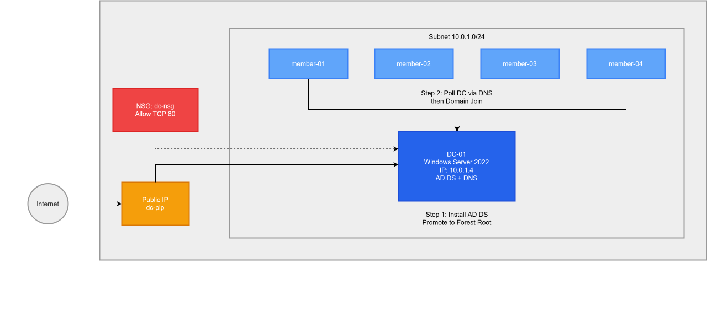
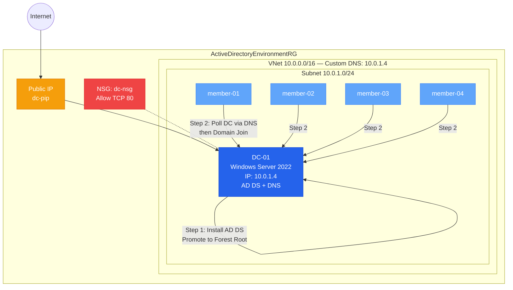

# Azure Active Directory Virtual Network Template

## Project Overview
This project provisions an Azure Virtual Network (VNet) pre-configured with a Windows Server 2022 Active Directory Domain Controller and a customizable number of domain-joined member Virtual Machines. 

## Architecture
The Terraform configuration creates the following Azure resources:
* **Resource Group:** Default name `ActiveDirectoryEnvironmentRG` in `indonesiacentral`.
* **Networking:** 
  * VNet (`10.0.0.0/16`) configured to use the Domain Controller as the custom DNS server.
  * Subnet (`10.0.1.0/24`).
* **Domain Controller (`dc-01`):** 
  * Static private IP (`10.0.1.4`) and a standard public IP.
  * Uses a Custom Script Extension to install AD Domain Services and promote the server to a Domain Controller upon boot.
* **Member Nodes (`member-0X`):** 
  * Dynamic scaling based on the `domain_member_count` variable.
  * Uses a polling mechanism during boot to wait for the DC to become reachable before automatically joining the AD domain.
* **Network Security Group (NSG):** Attached to the Domain Controller, currently configured to only allow inbound HTTP (port 80) traffic.

## Prerequisites
* Terraform `~> 3.0` installed.
* Azure CLI installed and authenticated.
* Sufficient permissions in the target Azure subscription to create compute and networking resources.

## Setup Instructions
1. Clone the repository to your local environment.
2. Initialize the Terraform workspace to download the AzureRM provider.
3. Create a `terraform.tfvars` file to supply the required variables. Example:
   domain_name    = "corp.local"
   admin_username = "sysadmin"
   admin_password = "ComplexPassword123!"

## Usage
Run the following commands to provision and manage the infrastructure:

1. Initialize the directory:
   terraform init

2. Verify the deployment plan:
   terraform plan

3. Deploy the resources:
   terraform apply

4. Destroy the environment:
   terraform destroy

## Variables
* `resource_group_name` (string): Target resource group name. Default is `ActiveDirectoryEnvironmentRG`.
* `location` (string): Azure region for the deployment. Default is `indonesiacentral`.
* `admin_username` (string): Local administrator username for all deployed VMs.
* `admin_password` (string): Administrator password for all deployed VMs (Sensitive).
* `domain_name` (string): The FQDN for the Active Directory domain (e.g., `corp.local`).
* `domain_member_count` (number): Number of domain-joined member VMs to create. Default is `4`.
* `dc_vm_size` (string): Compute size for the Domain Controller. Default is `Standard_D2s_v3`.
* `dc_image` (map): Image specifications (publisher, offer, sku, version) for the Domain Controller.
* `member_vm_size` (string): Compute size for the member VMs. Default is `Standard_D2s_v3`.
* `member_image` (map): Image specifications for the member VMs.

## Outputs
* `DCPublicIP`: The static public IP address assigned to the Domain Controller.

## Folder Structure
* `dc.tf`: Domain Controller VM, NIC, Public IP, and NSG definitions.
* `member.tf`: Member VMs and NIC definitions.
* `network.tf`: Resource Group, VNet, and Subnet definitions.
* `outputs.tf`: Output declarations.
* `provider.tf`: Terraform block and provider configurations.
* `variables_2.tf`: Variable declarations and defaults.
* `scripts/setup-dc.ps1.tftpl`: PowerShell template for AD DS installation and promotion.
* `scripts/setup-member.ps1.tftpl`: PowerShell template for domain join logic.
* `.terraform.lock_2.hcl`: Terraform provider dependency lock file.

## Notes / Common Issues
* **Provisioning Time:** The Domain Controller requires several minutes to install AD DS and perform the required reboots. Member VMs are coded to pause and poll the DC until DNS resolution succeeds.
* **Password Complexity:** Ensure `admin_password` meets Active Directory complexity requirements; otherwise, the automatic domain promotion and join scripts will silently fail.
* **Access:** RDP (port 3389) is explicitly commented out in the Network Security Group. Remote management must be done via internal networking or by manually modifying the NSG rules.
