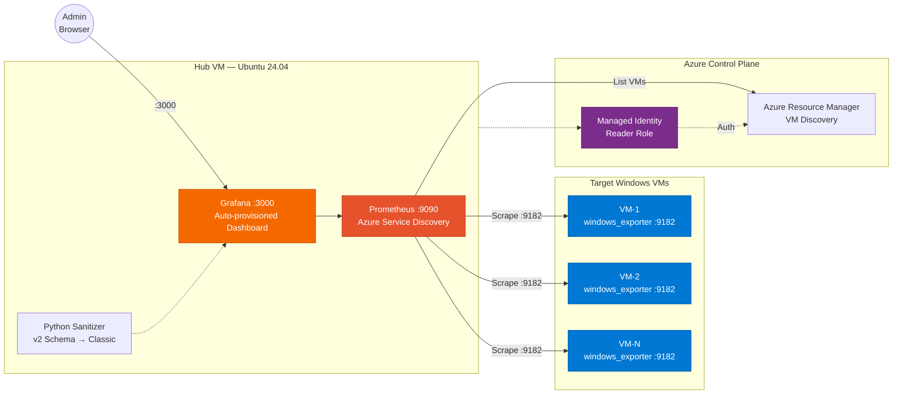

# Azure Windows VM Monitoring Stack



## Overview
This repository contains a Terraform deployment for an automated observability stack on Azure. It provisions a central Linux Hub Virtual Machine running Prometheus and Grafana within Docker containers. The stack automatically discovers and monitors Azure Windows Virtual Machines using Azure Service Discovery and the Prometheus Windows Exporter.

## Architecture
1. **Hub Virtual Machine**: An Ubuntu 24.04 LTS instance.
2. **Prometheus**: Runs in a Docker container on the Hub VM. Uses Azure Managed Identities (Reader role) to dynamically discover Windows VMs in the specified resource group.
3. **Grafana**: Runs in a Docker container on the Hub VM. It is automatically provisioned with the Prometheus data source and a pre-configured dashboard.
4. **Target Virtual Machines**: Existing Windows VMs. Terraform uses the Custom Script Extension to install `windows_exporter.msi` and open firewall port 9182.
5. **Python Sanitizer**: A boot script runs on the Hub VM to automatically convert Grafana 11 Unified Schema (v2) dashboards into the Classic Provisioning format to ensure seamless infrastructure-as-code deployments.

## Prerequisites
* Terraform v1.5.0 or newer.
* Azure CLI authenticated with `az login`.
* An existing Azure Resource Group containing the target Windows VMs.
* An active Azure Subscription where the user has Contributor and User Access Administrator roles (required for role assignments).

## Project Structure
* `main.tf`: Contains the Hub VM compute, networking, role assignments, and Windows Exporter extensions.
* `variables.tf`: Contains input definitions for credentials, subscription details, and IP restrictions.
* `cloud-init.yaml.tftpl`: The cloud-init template that installs Docker, writes provisioning files, executes the Python JSON sanitizer, and starts the containers.
* `dashboard.json`: The raw Grafana dashboard exported via "JSON Model".

## Configuration Variables
Define the following variables in a `terraform.tfvars` file or pass them via CLI:

* `subscription_id`: The Azure Subscription ID.
* `admin_ip_address`: The external IP address allowed to access ports 22 (SSH) and 3000 (Grafana).
* `admin_username`: SSH username for the Hub VM.
* `admin_password`: SSH password for the Hub VM.
* `grafana_admin_user`: Custom username for the Grafana web interface.
* `grafana_admin_password`: Custom password for the Grafana web interface.

## Deployment Instructions

1. Initialize the Terraform working directory.
   ```bash
   terraform init
   ```

2. Review the execution plan.
   ```bash
   terraform plan
   ```

3. Apply the configuration.
   ```bash
   terraform apply -auto-approve
   ```

4. Wait approximately 5 minutes after deployment completes. The Hub VM requires time to execute the `cloud-init` script, download Docker images, process the dashboard JSON, and start the services.

## Accessing the Services
* **Grafana**: Navigate to `http://<hub_public_ip>:3000`. Log in using the credentials defined in `grafana_admin_user` and `grafana_admin_password`.
* **Prometheus**: Ensure your IP is whitelisted for port 9090 in the Azure NSG, then navigate to `http://<hub_public_ip>:9090`. Check Status > Targets to verify Windows VM discovery.

## Troubleshooting

### Grafana Dashboard is Empty or Broken
If the dashboard fails to load or shows no data, verify the Python sanitizer execution logs on the Hub VM.
```bash
cat /var/lib/grafana/dashboards/error.log
```

### Prometheus Targets are Down
If Prometheus shows targets as DOWN, verify the Windows Exporter installed correctly on the target VMs. Ensure the target Windows firewall allows inbound TCP traffic on port 9182.

### Containers Fail to Start
Connect to the Hub VM via SSH and inspect the Docker daemon and container logs.
```bash
sudo docker ps -a
sudo docker logs prometheus
sudo docker logs grafana
```
