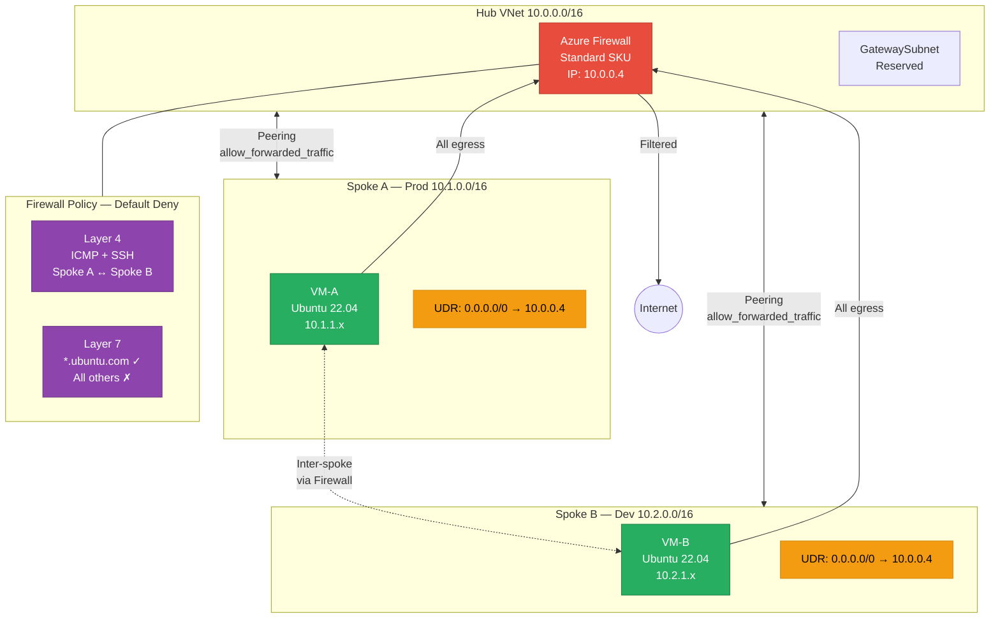

# Azure Enterprise Hub-and-Spoke Network Topology

## Project Overview
This project demonstrates the implementation of a secure, scalable Hub-and-Spoke network architecture within Microsoft Azure using Terraform. The primary objective is to centralize security governance and traffic inspection via a managed Azure Firewall, ensuring that all cross-spoke and egress traffic is strictly controlled through User Defined Routes (UDRs).

## Technical Specifications
* **Region:** southeastasia
* **Resource Group:** rg-hubspoke-lab-sea
* **Orchestration:** Terraform (azurerm provider v3.0+)
* **Workloads:** Ubuntu 22.04 LTS (Standard_B1s)

### IP Address Management (IPAM)
| Component | CIDR Block | Subnets |
| :--- | :--- | :--- |
| **Hub VNet** | 10.0.0.0/16 | AzureFirewallSubnet (/26), GatewaySubnet (/27) |
| **Spoke A (Prod)** | 10.1.0.0/16 | snet-workload-a (10.1.1.0/24) |
| **Spoke B (Dev)** | 10.2.0.0/16 | snet-workload-b (10.2.1.0/24) |

## Architecture Implementation

### Phase 1: Foundation
Virtual Networks and subnets were provisioned to establish strict boundary isolation. The `AzureFirewallSubnet` name is non-negotiable as the Azure Firewall resource provider requires this specific string for deployment. 

### Phase 2: Connectivity
VNet Peering was established between the Hub and each Spoke. 
* **allow_forwarded_traffic:** Set to `true` on the Hub peering links to allow transit traffic from one spoke to another via the Hub.
* **allow_gateway_transit:** Configured for future VPN/ExpressRoute integration.
* **Direct Spoke-to-Spoke Peering:** Intentionally omitted to enforce a centralized inspection model.

### Phase 3: Security Core
A Standard SKU Azure Firewall was deployed into the Hub. This appliance acts as the "Next Hop" for the entire topology, providing stateful inspection and Layer 7 filtering.

### Phase 4: Routing Logic
User Defined Routes (UDRs) were applied to the Spoke workload subnets. A default route (**0.0.0.0/0**) with a Next Hop Type of **VirtualAppliance** was configured to point to the Firewall's private IP (10.0.0.4). This overrides Azure System Routes, forcing all traffic through the security core.

### Phase 5: Policy and Validation
Firewall policies were implemented to permit specific traffic while maintaining a default-deny posture.

#### Network Rules (Layer 4)
* **ICMP:** Allowed between Spoke A and Spoke B for connectivity testing.
* **SSH (TCP/22):** Allowed for management between spokes.

#### Application Rules (Layer 7)
* **Allowed FQDNs:** `*.ubuntu.com` and `azure.archive.ubuntu.com` (HTTP/HTTPS).
* **Blocked FQDNs:** All other internet traffic (e.g., google.com).

## Validation Results

### 1. Inter-Spoke Connectivity (ICMP)
Validation via `az vm run-command` from Spoke B to Spoke A:
* **Result:** 0% packet loss.
* **Technical Indicator:** TTL=63 (Confirms one hop through the Firewall appliance).

### 2. Egress Traffic Inspection
Validation of Layer 7 filtering from Spoke A:
* **Target:** `http://azure.archive.ubuntu.com` -> **Status 200 OK** (Permitted).
* **Target:** `http://www.google.com` -> **Status 470** (Terminated by Azure Firewall).

## Security Principles Applied
* **Least Privilege:** Only required ports and FQDNs are exposed.
* **Centralized Egress:** Eliminates the need for Public IPs on workload VMs, reducing the attack surface.
* **Stateful Inspection:** Ensures that only initiated sessions receive return traffic.
