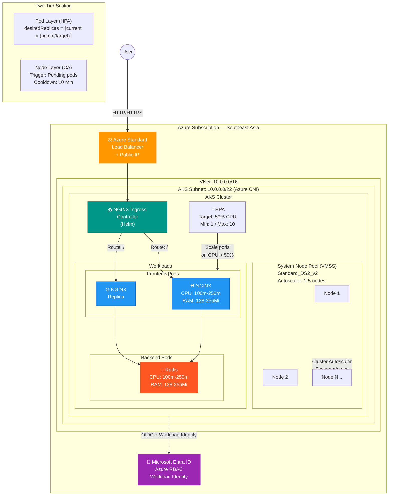

# Project Documentation: Enterprise AKS Deployment (Southeast Asia)

## 1. Executive Summary
This project involved the automated provisioning of a production-grade Azure Kubernetes Service (AKS) cluster using Terraform. The architecture implements Azure CNI for networking, Entra ID (Azure AD) for identity management, and a two-dimensional scaling model to ensure application elasticity and cost-efficiency.

---

## 2. Infrastructure Architecture (Phase 1 & 2)

### 2.1 Networking Foundation
The network layer utilizes the **Azure CNI (Container Networking Interface)** plugin. This configuration assigns every pod an IP address directly from the Virtual Network (VNet) subnet, facilitating direct connectivity and high performance.

*   **VNet Address Space:** 10.0.0.0/16
*   **AKS Subnet:** 10.0.0.0/22 (1,024 IP addresses)
*   **Service CIDR:** 10.1.0.0/16
*   **DNS Service IP:** 10.1.0.10

**Comparison of IP Consumption:**

| Feature | Azure CNI | Kubenet |
| :--- | :--- | :--- |
| **Pod IP Assignment** | Direct VNet IP | Internal Overlay IP |
| **Routing** | Native VNet Routing | IP Forwarding and NAT |
| **Performance** | Maximum (No NAT overhead) | Lower (NAT overhead) |
| **Scale Constraint** | Limited by Subnet size | Limited by Route Table entries |

### 2.2 Cluster Configuration
The AKS cluster is deployed with a System-Assigned Managed Identity to govern interactions with Azure resources.

*   **Node Pool:** `systempool` utilizing `Standard_DS2_v2` (2 vCPUs, 7 GB RAM).
*   **Node Scaling:** Azure Virtual Machine Scale Set (VMSS) with Cluster Autoscaler.
*   **Identity:** Microsoft Entra ID integration with Azure RBAC enabled.
*   **Security:** OIDC Issuer and Workload Identity enabled for secure, identity-based access to cloud resources.

---

## 3. Workload Management (Phase 3)

The application layer consists of a front-end NGINX tier and a back-end Redis tier, serving as a template for multi-tier microservices.

### 3.1 Resource Governance
Resource constraints are enforced at the container level to ensure predictable scheduling and prevent "noisy neighbor" scenarios where one pod starves others of resources.

*   **Requests:** The minimum guaranteed resource allocation used by the `kube-scheduler` to place pods.
*   **Limits:** The maximum resource ceiling enforced by the Linux kernel (CFS for CPU throttling, OOM Killer for Memory termination).

**Resource Allocation Matrix:**

| Component | CPU Request | CPU Limit | RAM Request | RAM Limit |
| :--- | :--- | :--- | :--- | :--- |
| **Frontend** | 100m | 250m | 128Mi | 256Mi |
| **Backend** | 100m | 250m | 128Mi | 256Mi |

---

## 4. Traffic Orchestration (Phase 4)

External access is managed via an **NGINX Ingress Controller** deployed through the Terraform Helm provider.

### 4.1 Load Balancer Mapping
When the Ingress Controller service (type: `LoadBalancer`) is created, the AKS Cloud Controller Manager (CCM) interfaces with the Azure Resource Manager (ARM). ARM provisions an **Azure Standard Load Balancer**, creates a Public IP, and configures Frontend IP configurations and Health Probes. The Ingress Controller then routes traffic to internal `ClusterIP` services based on defined rules.

---

## 5. Elasticity & Scaling Logic (Phase 5)

The cluster implements a two-tier scaling mechanism to match infrastructure capacity with real-time demand.

### 5.1 Horizontal Pod Autoscaler (HPA)
The HPA monitors CPU utilization and adjusts the number of replicas based on the following algorithm:

$$\text{desiredReplicas} = \lceil \text{currentReplicas} \times \frac{\text{currentMetricValue}}{\text{desiredMetricValue}} \rceil$$

### 5.2 Cluster Autoscaler (CA)
The CA manages the infrastructure layer (the nodes):
1.  **Scale-Out:** Triggered when pods are in a `Pending` state due to `Insufficient CPU` or `Insufficient Memory` on existing nodes.
2.  **Scale-In:** Triggered when nodes are underutilized (typically < 50%) for more than 10 minutes and pods can be safely relocated.

---

## 6. Operations & Verification Reference

### 6.1 Deployment Verification
`kubectl get nodes -o wide && kubectl get pods -A && kubectl get svc -A`

### 6.2 Scaling Verification
`kubectl get hpa azure-vote-front-hpa -w`

### 6.3 Infrastructure Cleanup
`terraform destroy -auto-approve`
