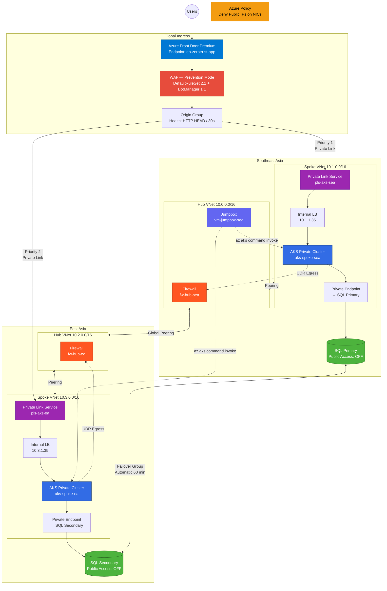

# Azure Multi-Region Zero Trust Architecture



## Project Overview
This project provisions a production-grade multi-region Zero Trust network architecture in Azure using Terraform. It deploys a hub-and-spoke topology across Southeast Asia (SEA) and East Asia (EA) with private AKS clusters, Azure Front Door with WAF, Private Link Services, SQL Failover Groups, and Azure Firewall — all with no direct public exposure to workloads. The infrastructure is deployed in four sequential phases via an automated orchestration script.

## Architecture / What it Creates
* **Resource Groups:**
  * `rg-hub-sea` (Southeast Asia hub)
  * `rg-hub-ea` (East Asia hub)
  * `rg-spoke-sea` (Southeast Asia spoke)
  * `rg-spoke-ea` (East Asia spoke)
* **Networking:**
  * Hub VNets: `vnet-hub-sea` (10.0.0.0/16), `vnet-hub-ea` (10.2.0.0/16)
  * Spoke VNets: `vnet-spoke-sea` (10.1.0.0/16), `vnet-spoke-ea` (10.3.0.0/16)
  * Full mesh peering: Hub-to-Spoke (regional) + Hub-to-Hub (global)
  * Azure Firewall (Basic SKU) in each hub with forced tunneling from spokes
  * Route tables enforcing all egress through firewall
* **Compute:**
  * Private AKS clusters in each spoke (workload identity enabled, CNI networking)
  * Jumpbox VM (`vm-jumpbox-sea`) in SEA hub for cluster management via SSH
  * Internal Load Balancers in each AKS cluster for Private Link Service exposure
* **Data:**
  * Azure SQL Servers (primary in SEA, secondary in EA) with private endpoints
  * SQL Failover Group with automatic failover (60-minute grace period)
  * Private DNS zone (`privatelink.database.windows.net`) linked to all VNets
* **Global Ingress:**
  * Azure Front Door Premium with Private Link origins to both AKS regions
  * WAF policy (Prevention mode) with Microsoft DefaultRuleSet 2.1 and BotManagerRuleSet 1.1
  * Private Link Services in each spoke with automated connection approval
* **Security Policies:**
  * Azure Policy: Deny public IP association on NICs (subscription-wide)
  * Policy exemption for the jumpbox NIC (sole authorized exception)
  * NSG on jumpbox restricting SSH to configurable CIDR

## Prerequisites
* Terraform >= 1.0 with AzureRM provider ~> 3.0 installed.
* Azure CLI installed and authenticated.
* PowerShell (Windows PowerShell or pwsh) available in PATH.
* Sufficient Azure subscription permissions (Owner or Contributor + User Access Administrator).
* Azure Front Door Premium SKU requires the subscription to be registered for `Microsoft.Cdn`.

## Setup Instructions
1. Clone the repository to your local machine.
2. Navigate to the project root directory.
3. Create `phase2_data/terraform.tfvars`:
   ```
   admin_username = "sqladmin"
   admin_password = "YourComplexPass123!"
   region1        = "southeastasia"
   region2        = "eastasia"
   ```
4. Create `phase3_compute/terraform.tfvars`:
   ```
   vm_admin_username = "azureuser"
   vm_admin_password = "YourComplexPass123!"
   allowed_ssh_cidr  = "YOUR.PUBLIC.IP/32"
   ```

## Usage
Run the following commands to manage the infrastructure:

1. **Deploy All Phases (Automated):**
   ```powershell
   .\manage.ps1 -Action apply
   ```
   This sequentially runs `terraform init` and `terraform apply` across all four phases in order.

2. **Destroy All Phases (Reverse Order):**
   ```powershell
   .\manage.ps1 -Action destroy
   ```

3. **Deploy Individual Phase:**
   ```powershell
   cd phase1_networking
   terraform init
   terraform apply
   ```

4. **Verify WAF (SQL Injection Block):**
   ```powershell
   $ep = az afd endpoint show --resource-group rg-hub-sea --profile-name fd-zerotrust-global --endpoint-name ep-zerotrust-app --query hostName -o tsv
   curl.exe -I -s -w "%{http_code}" "https://$ep/?id='OR+1=1"
   # Expected: 403
   ```

5. **Verify Private Link Approval:**
   ```powershell
   az network private-link-service show --name pls-aks-sea --resource-group rg-spoke-sea --query "privateEndpointConnections[0].privateLinkServiceConnectionState.status" -o tsv
   # Expected: Approved
   ```

6. **Verify SQL Failover Group:**
   ```powershell
   az sql failover-group list --resource-group rg-hub-sea --server sql-primary-sea-tkqgc9 --query "[0].{name:name, role:replicationRole}" -o table
   ```

7. **Verify Policy Assignment:**
   ```powershell
   az policy assignment list --query "[?name=='assign-deny-public-ips'].name" -o tsv
   # Expected: assign-deny-public-ips
   ```

## Variables

### phase2_data
| Variable | Type | Description |
|----------|------|-------------|
| `admin_username` | string | SQL Server administrator login |
| `admin_password` | string (sensitive) | SQL Server administrator password |
| `region1` | string | Primary region (default: southeastasia) |
| `region2` | string | Secondary region (default: eastasia) |

### phase3_compute
| Variable | Type | Description |
|----------|------|-------------|
| `vm_admin_username` | string | Jumpbox VM administrator username |
| `vm_admin_password` | string (sensitive) | Jumpbox VM administrator password |
| `allowed_ssh_cidr` | string | CIDR allowed to SSH into jumpbox (default: Internet) |

## Folder Structure
```
11 Multi Region Zero Trust Architecture/
├── manage.ps1                  # Orchestration script (apply/destroy all phases)
├── README.md
├── phase1_networking/          # VNets, Subnets, Peering, Firewalls, Route Tables
│   ├── vnet.tf
│   ├── subnets.tf
│   ├── peering.tf
│   ├── firewall.tf
│   ├── firewall_rules.tf
│   ├── routing.tf
│   ├── resource_groups.tf
│   ├── variables.tf
│   └── providers.tf
├── phase2_data/                # SQL Servers, Failover Group, Private Endpoints, DNS
│   ├── sql_servers.tf
│   ├── failover.tf
│   ├── endpoints.tf
│   ├── dns.tf
│   ├── data.tf
│   ├── variables.tf
│   └── providers.tf
├── phase3_compute/             # AKS Clusters, Jumpbox, RBAC, DNS Links
│   ├── aks.tf
│   ├── jumpbox.tf
│   ├── rbac.tf
│   ├── dns_links.tf
│   ├── data.tf
│   ├── variables.tf
│   └── providers.tf
└── phase4_final/               # Front Door, WAF, Private Link Services, Policy
    ├── frontdoor.tf
    ├── waf.tf
    ├── pls.tf
    ├── bootstrap.tf
    ├── policy.tf
    ├── data.tf
    └── providers.tf
```

## Phase Deployment Order

| Phase | Purpose | Key Resources |
|-------|---------|---------------|
| 1 - Networking | Foundation | VNets, Subnets, Peering, Firewalls, Route Tables |
| 2 - Data | Stateful Services | SQL Servers, Failover Group, Private Endpoints, DNS Zones |
| 3 - Compute | Workloads | AKS Clusters, Jumpbox VM, RBAC, DNS Links |
| 4 - Final | Global Ingress & Policy | Front Door, WAF, Private Link Services, Policy |

## Notes / Common Issues
* **Front Door Private Link Approval:** Azure Front Door creates private endpoint connections from a Microsoft-managed subscription, not yours. The `auto_approval_subscription_ids` field on the PLS cannot match Microsoft's subscription. The `null_resource` provisioners in `pls.tf` handle this by auto-approving pending connections via Azure CLI after the Front Door origin is created.
* **PowerShell `curl` Alias:** In PowerShell, `curl` is aliased to `Invoke-WebRequest`. Always use `curl.exe` explicitly when testing with curl flags like `-I`, `-s`, `-w`.
* **Azure CLI SQL Commands:** Use `az sql` (not `az mssql`). The `mssql` prefix does not exist in Azure CLI.
* **Jumpbox SSH Access:** The NSG defaults to `Internet` for SSH source. For production, set `allowed_ssh_cidr` to your specific public IP CIDR in `phase3_compute/terraform.tfvars`.
* **AKS Egress:** The clusters use `outboundType: loadBalancer` (default). Spoke route tables force non-AKS traffic through the firewall, but AKS manages its own egress via a managed load balancer.
* **Failover Test Limitation:** Disabling an origin in Front Door will result in 504 if the remaining origin has no backend pods responding. The `trigger-ilb` service is a dummy service (selector: `app: dummy`) used solely to provision the internal load balancer for Private Link Service attachment. Real failover requires application pods deployed behind the ILB.
* **DNS Resolution from AKS Pods:** The SQL private DNS zone is linked to all four VNets (hubs + spokes), ensuring pods can resolve `*.privatelink.database.windows.net` to private IPs.
* **Deployment Time:** Full deployment takes approximately 30-45 minutes. The majority of time is spent on Azure Firewall provisioning (~15 min each) and AKS cluster creation (~10 min each).
